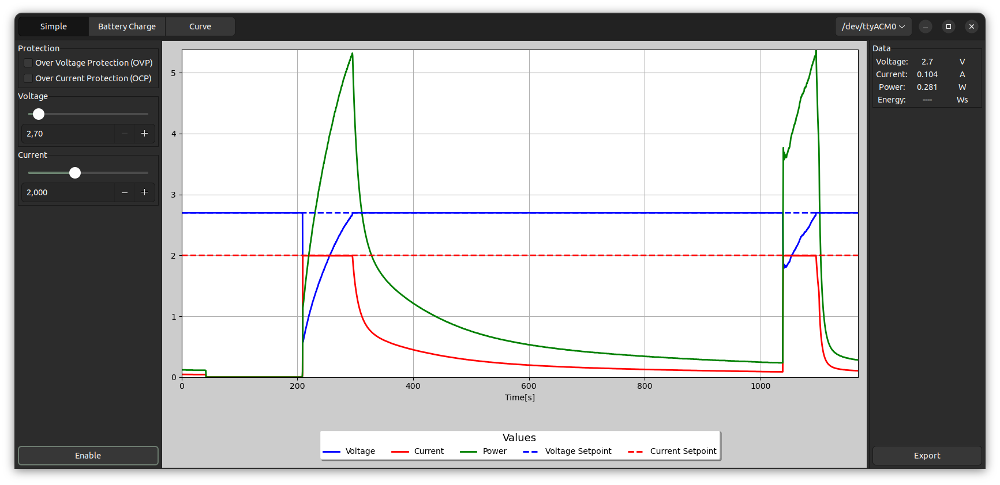

# Overview


This project aims to provide a simple and yet powerful tool to extend the functionality of Korad lab bench power supllies.


# Installation

Clone this repository, install python3 and pip and run
```bash
python3 -m pip install -r requirements.txt
```

# Usage
Run 
```bash
python3 main.py
```
